# Group 1 - Columbia Engineering - FinTech Bootcamp

# Where Should I Put My Money After an Economic Crisis?

## A Study of the 2000 and 2007 Post-Recession Period on Different Asset Classes and Their Returns

### Which of these asset classes performs the best following a recession?

* S&P 500 - “The Market” 
* Gold
* Emerging Markets
* Real Estate
* Bonds

### Does the nature of recessions affect the performance of the assets in the future?

No two recessions are alike; for our study, we chose to examine the 2000 and 2007 recession. For 2000, this recession was caused by the burst of the Internet Bubble, while for 2007, this recession was caused by sub-prime mortgages.

### Why did we choose this topic?

* Opportunity
* Risk Management

### What was our process?

#### Data Pulling

* Data Background
* Information is for monthly data at the beginning of the month (ie, 8/1/2000; 9/1/2000, etc).
* Data Types Used
	* API
	* We used the Quandl API to pull data for the S&P 500
CSVs
	* We utilized Yahoo! Finance for a majority of the asset classes
	* We used St. Louis FRED Data for the real estate prices
	* Bond Funds
		* The two bond funds selected are the BlackRock Core Bond Portfolio (Nasdaq: BFMCX) and BlackRock U.S. Government Bond Portfolio (Nasdaq: PNIGX). 
	* Equity Funds
		* The equity fund selected is the BlackRock Emerging Markets Fund (Nasdaq: MADCX)

	* In addition to REITs and Bonds, we included Gold and the S&P 500 for baseline investment data. The S&P 500 was used, in this instance, to indicate market performance in general. Gold returns are included to demonstrate alternative portfolio options. In general, Gold tends to perform at an inverse to paper investments(stocks, bonds, etc.), so we wanted to analyze how it performed during and immediately following market recessions.  

#### Data Analysis

* Import Libraries
* Clean Data
* Concat Data
* Run a Cumulative Portfolio
* Risk Metrics (Standard Deviation/Sharpe)
* Calculate Covariance/Beta

This was the same analysis done for all parts

#### Aditional Analysis

* After our analysis of 2000 and 2007; we determined the best asset classes on a returns basis were Emerging Markets and Gold, 
* We chose to create an equally weighted portfolio (50/50) split between Emerging Markets and Gold to create simulated return values for the current 2020 recession.
* We ran a Monte Carlo with 500 Simulations using data from 2007-2014 to hypothesize potential investment returns for the current 2020 recession period. 

### What were the problems?

* Using Git to branch and merge
* Well Tower had incorrect data
* Uniformity in the Data sets caused us to use the monthly data 
for all data sets. 
* We had originally planned to use the last 3 recessions but with data for our REIT we could only get for the last two
* Premium APIs would have allowed an easier integration of the necessary data into the notebook

### Additional Questions

* More recessions periods and more diverse portfolios 
	* Testing more start/end dates of each recession. Assets/markets top/bottom at different times and also the Official start/end dates are revised later so a more robust test of different dates would be needed.
* Monte Carlo simulation for all the asset classes moving forward
* Additional asset classes
* Utilize daily data as opposed to monthly for more accurate models
	* Some asset classes only go back 10 years

### Images

#### 2000 Asset Beta

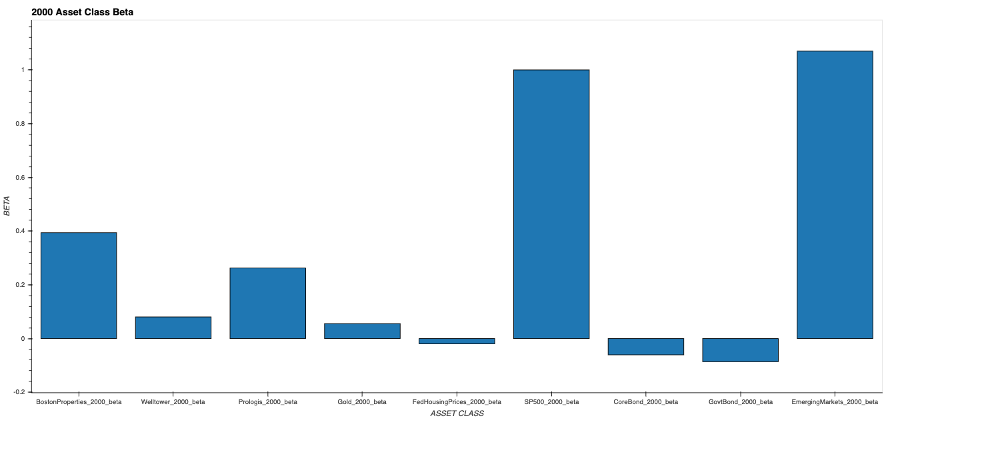

#### 2000 Sharpe Ratios

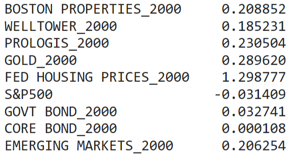

#### 2000 Standard Deviation

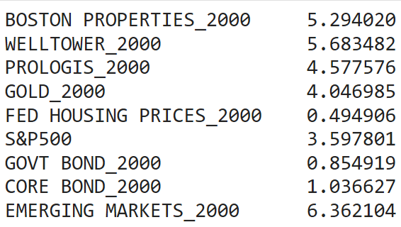

#### 2007 Asset Beta

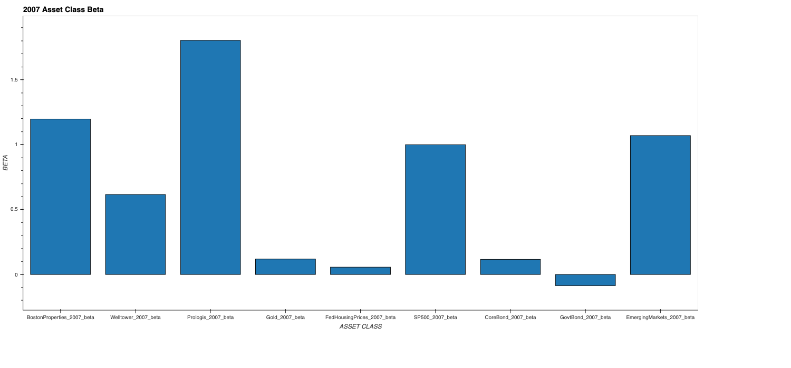

#### 2007 Sharpe Ratios

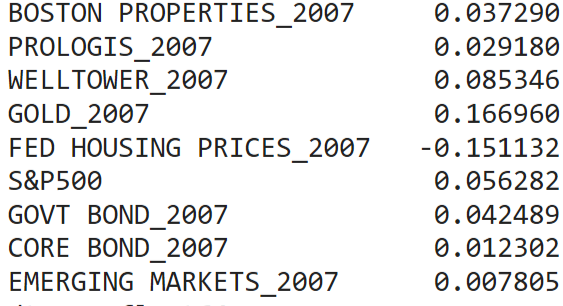

#### 2007 Standard Deviation

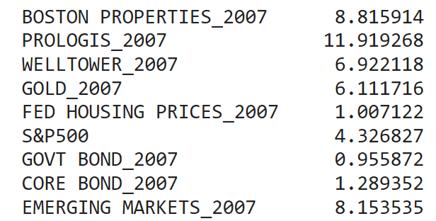

#### 2000 Cumulative Returns

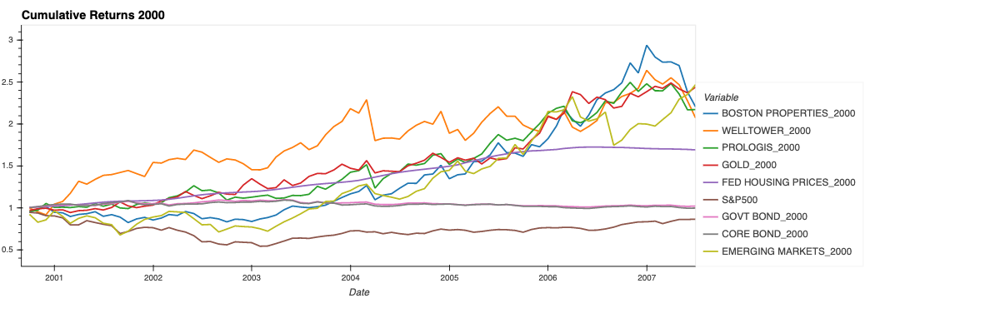

#### 2007 Cumulative Returns

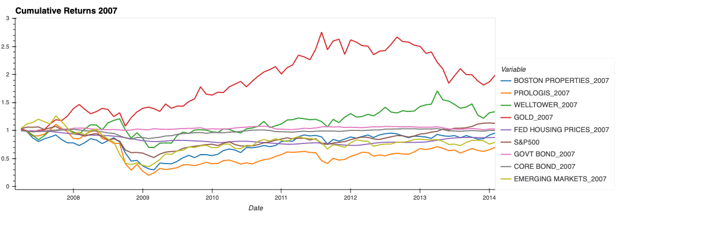

#### 2014 Cumulative Returns

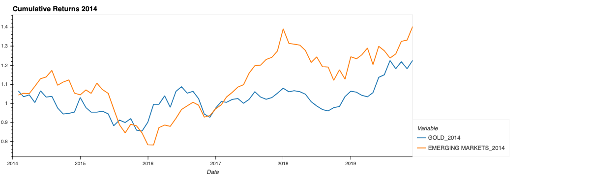

#### 2000 Portfolio Risk
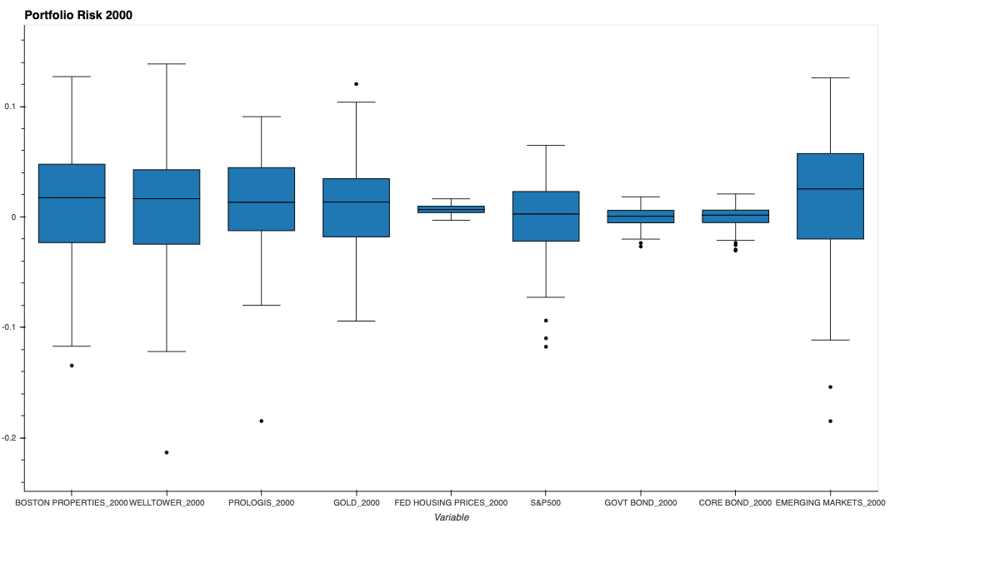

#### 2007 Portfolio Risk

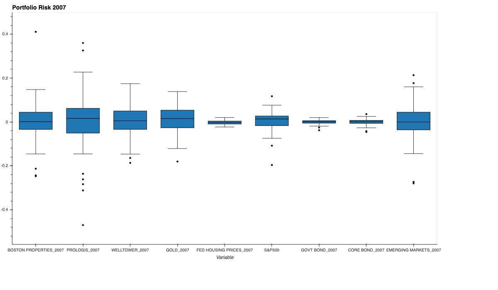

#### 2000 RET

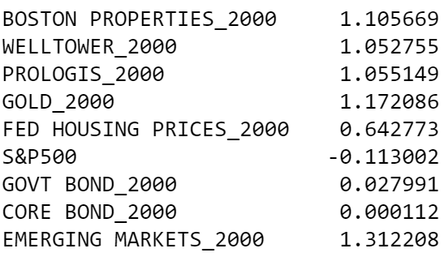

#### 2007 RET

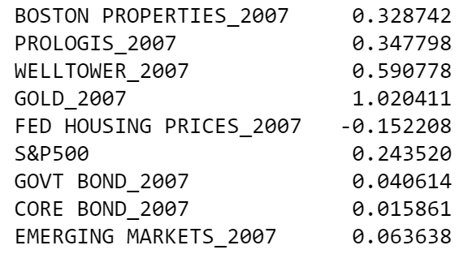
